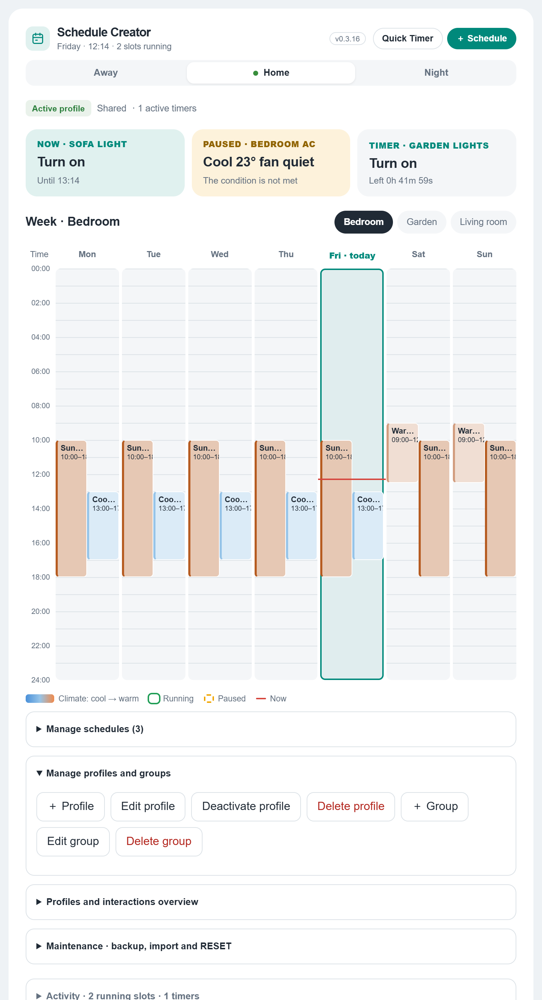
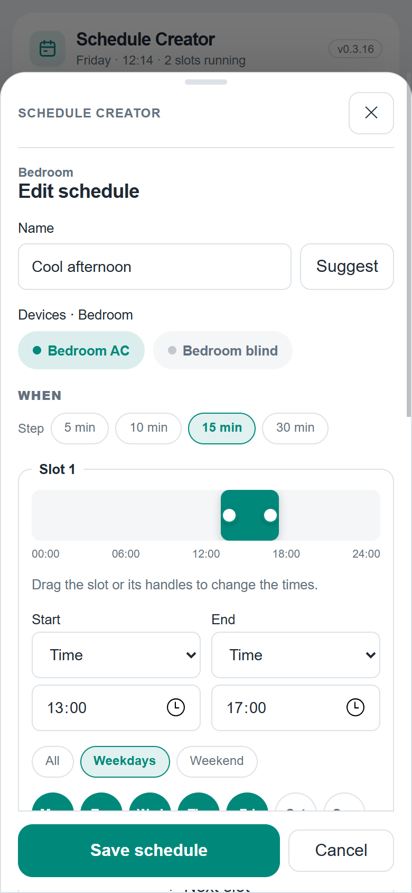
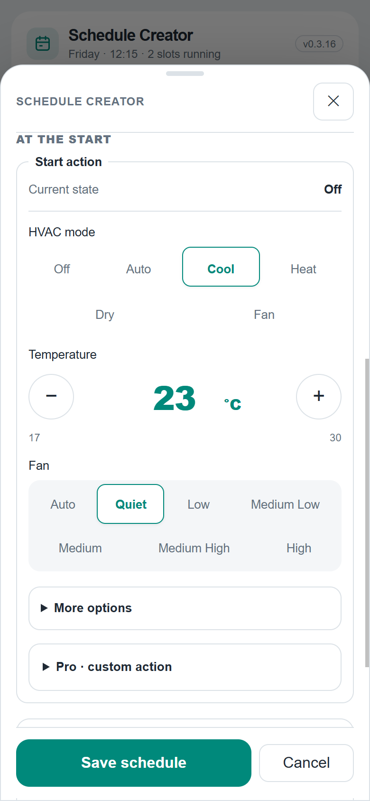
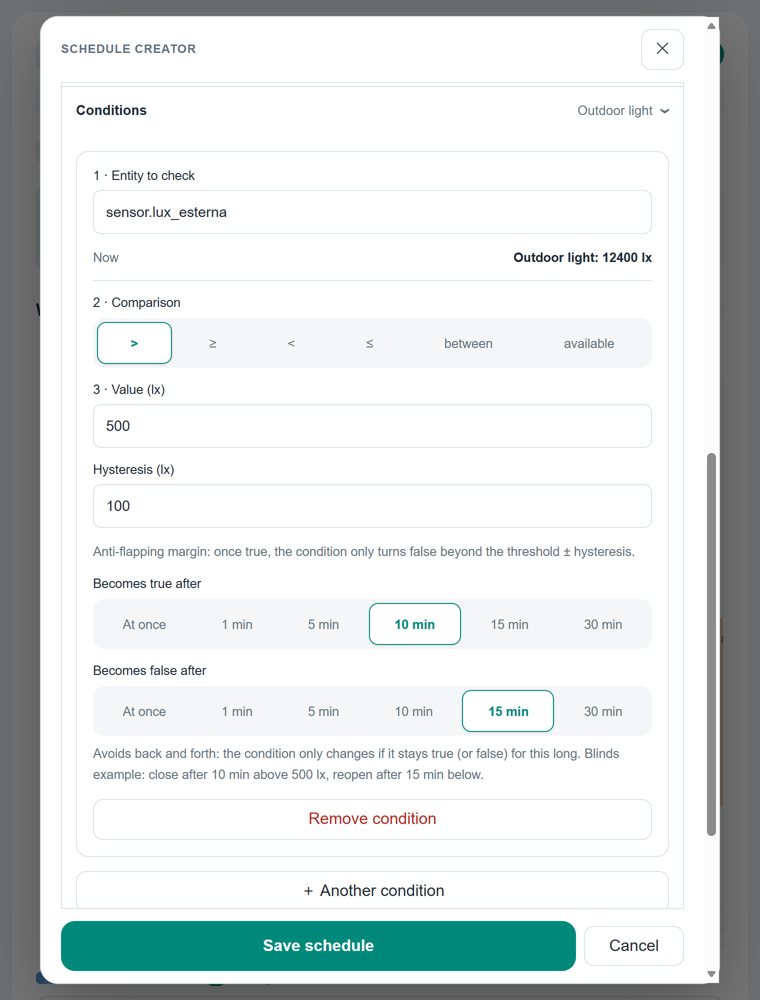
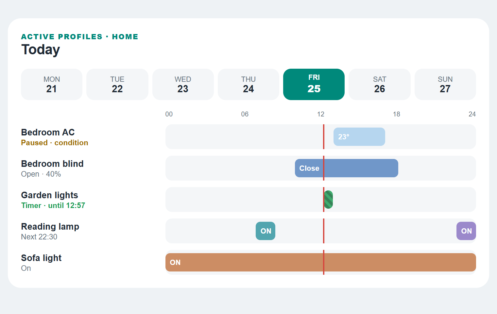
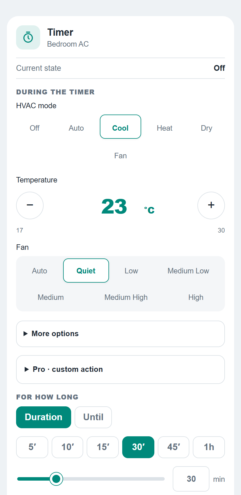
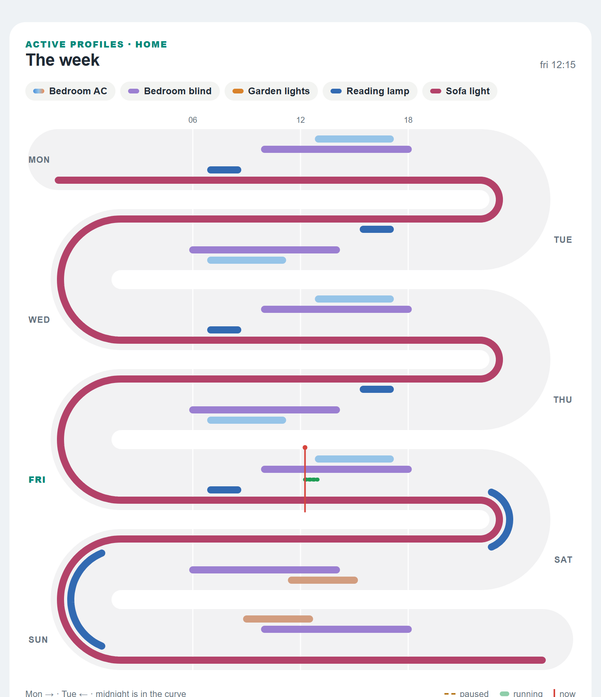
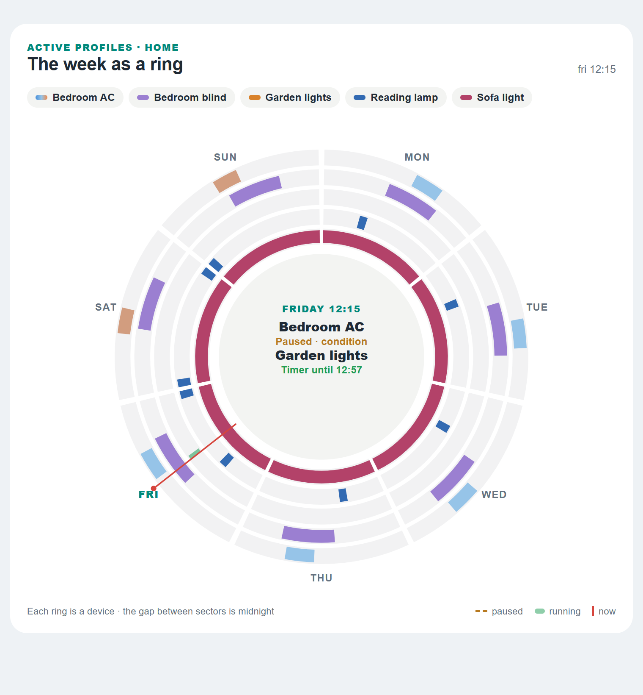

# Schedule Creator

Weekly schedules, conditions and quick timers for Home Assistant, run by a native
integration instead of dashboard helpers. Schedules keep running when no dashboard
is open, survive restarts and come with five Lovelace cards.

Schedule Creator is the server-side successor of
[weekly-schedule-card](https://github.com/arozoire/weekly-schedule-card). The two
can live side by side; schedules can be imported from the old card's backup
(see [Moving from weekly-schedule-card](#moving-from-weekly-schedule-card)).

> The cards speak **English, Italian, French, German and Spanish**, following the
> language of each Home Assistant user (add `language: en` to a card to force
> one). The screenshots below come from the repository preview
> (`frontend/preview.html`) with demo data, not from a real installation.



## Highlights

- **Profiles and groups** – organise the house by habits (home, away, night) and
  rooms. Exclusive profiles switch each other off; shared ones run together.
- **Weekly time slots** – drag a slot on a 24 h bar that shows the other
  schedules of the same devices and snaps to their edges. Weekday / weekend
  shortcuts, several slots per schedule, overnight slots, and start or end at
  sunrise / sunset with an offset.
- **Desired-state actions** – climate mode, temperature, fan and swing in one
  step; brightness, cover position and fan speed as percentage sliders; an
  optional action at the end of the slot, or "previous state" to put the
  device back as it was when the slot started.
- **Conditions** – pick an entity first, then only the comparisons that fit it
  (numbers with units, on/off, options). Hysteresis plus *become true after* and
  *become false after* delays stop devices from flapping.
- **Live status** – "now" tiles, today's column with a now line, running and
  paused slots, temperature-coloured climate blocks, optional persistent
  notification for the whole slot.
- **Quick timers** – "cool to 23° for 30 minutes": the previous state is
  restored when the timer ends.
- **Safe by design** – every command goes through a durable journal with
  retries; nothing is replayed blindly after a restart.
- **Backup, restore and RESET** from the card.
- **Import from weekly-schedule-card** – load its backup file, review what
  each schedule becomes and add it as a new, inactive profile.

## Screenshots

| Schedule editor (phone) | Start action | Conditions |
| --- | --- | --- |
|  |  |  |

| Timeline card | Quick Timer card |
| --- | --- |
|  |  |

| Serpentine card | Ring card |
| --- | --- |
|  |  |

## Installation

Requires Home Assistant 2026.9.2 or newer and [HACS](https://hacs.xyz).

1. In HACS open **⋮ → Custom repositories**, add
   `https://github.com/arozoire/schedule_creator` as an **Integration**.
2. Download **Schedule Creator** and restart Home Assistant.
3. Go to **Settings → Devices & services → Add integration** and add
   **Schedule Creator**.
4. Add a card to a dashboard (**Add card → Manual**):

   ```yaml
   type: custom:schedule-creator-card
   title: Schedule Creator
   ```

The cards load automatically; you do not need to add a Lovelace resource.
An existing resource pointing to `/schedule_creator/frontend/schedule-creator-card.js`
keeps working.

## Cards

All five cards ship in the same file and share the same backend data.

### Main card

```yaml
type: custom:schedule-creator-card
title: Schedule Creator   # optional
```

Create profiles, groups and schedules, see what is running now and manage
backups. Editing requires an administrator; other users get a read-only view.

### Timeline card

```yaml
type: custom:schedule-creator-timeline-card
title: Today                               # optional
entities: [climate.bedroom, cover.bedroom] # optional filter and order
```

One 24 h row per device for the selected weekday, combining the schedules of
**all active profiles**, with the current status next to each row. Read-only.

### Serpentine and ring cards

```yaml
type: custom:schedule-creator-serpentine-card   # or custom:schedule-creator-ring-card
title: The week                          # optional
entities: [climate.bedroom, cover.bedroom] # optional filter and order
max_lanes: 6                             # optional, up to 8
edit_path: /lovelace/schedules           # optional: view that holds the main card
```

The whole week of **all active profiles** at a glance, one lane per device.
The **serpentine** runs Monday left to right, Tuesday right to left and so on:
midnight sits in the U-turn, so overnight slots follow the curve instead of
being cut. The **ring** has seven day sectors clockwise from the top and one
ring per device, with what is happening now in the centre.

Tap a slot to see its details. **Edit** opens it in the main card on the same
view, or goes to `edit_path` and opens it there.

### Quick Timer card

```yaml
type: custom:schedule-creator-quick-timer-card
entity: climate.bedroom   # optional: without it the card offers a searchable list
presets: [5, 15, 30, 60]  # optional, minutes
```

Choose what the device should do during the timer and for how long (presets,
slider or "until" a time). While a timer runs the card shows a countdown and a
cancel button; when it ends the previous state is restored.

## How it works

- **Priority** – when two slots control the same entity the one that started last
  wins; on a tie a quick timer beats a conditional schedule, which beats a plain
  one. Only schedules of active profiles run.
- **Conditions** – while a condition is false the end action runs (if any);
  when it becomes true again the start action is applied. Example for sun
  blinds: lux > 500, hysteresis 100, become true after 10 min, become false after
  15 min, start action *close*, end action *open*.
- **Notifications** – start/end notifications with suggested text, an optional
  persistent status notification during the slot, and a dashboard path opened
  when a notification is tapped in the companion app.

## Moving from weekly-schedule-card

1. In weekly-schedule-card open **Groups → Maintenance → Save configuration**.
2. In Schedule Creator open **Maintenance → Import from Weekly Schedule Card**
   and choose that file.
3. Review the preview: every schedule is marked ready, to check, imported
   disabled or not imported, with the reason (e.g. conditions on attributes,
   one-off schedules and date ranges are not supported yet).
4. Import. Everything lands in a new profile that stays **inactive**.
5. Turn the old schedules off in weekly-schedule-card (or Scheduler), then
   activate the imported profile. Nothing in weekly-schedule-card or Scheduler
   is changed by the import.

## Updating

After a HACS update restart Home Assistant (new Python code is only loaded on
restart) and reload the dashboard. The card compares its version with the
running integration and tells you whether a page reload or a restart is still
needed. No cache clearing or `?v=` parameters are required.

## Documentation

- [Card and installation details](docs/frontend.md) (Italian)
- Translations: `frontend/src/i18n-strings.js` (Italian text is the key)
- [WebSocket API](docs/websocket-api.md)
- [Storage schema and journal](docs/storage-schema.md)
- [Development hand-off notes](docs/ai-handoff.md) (Italian)

## Development

```bash
cd frontend
npm ci
npm run build   # writes custom_components/schedule_creator/frontend/schedule-creator-card.js
npm test
```

Python checks run in CI (`ruff`, `mypy`, `pytest` with
`pytest-homeassistant-custom-component`). To refresh the screenshots, serve the
repository root on port 8765, start a Chromium browser with
`--remote-debugging-port=9333` and run `node frontend/screenshots.mjs`.

## License

[MIT](LICENSE)
